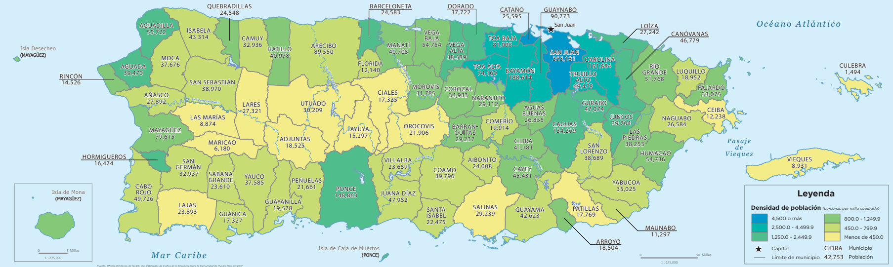

---
output:
  word_document:
    reference_docx: estilo.docx
  pdf_document: default
number-sections: true
number-depth: 2
bibliography: references.bib
csl: apa.csl
link-citations: true
---

```{r setup, include=FALSE}
# ============================================================
# CONFIGURACIÓN GENERAL
# ============================================================
knitr::opts_chunk$set(
  echo = FALSE,
  warning = FALSE,
  message = FALSE
)

# ============================================================
# LIBRERÍAS (Agregue aquí todas las librerías que necesite)
# ============================================================
suppressPackageStartupMessages({
library(tidyverse)
library(knitr)
library(flextable)
})
```

# Título del Proyecto

## Resumen


Incluya un resumen de no más de 250 palabras que presente de manera breve el propósito del trabajo, la metodología utilizada, los principales resultados y la importancia de los hallazgos. Evite incluir referencias, tablas, figuras o expresiones matemáticas extensas.


**Palabras clave:** palabra 1, palabra 2, palabra 3, palabra 4.

## Introducción

### Subsección 

#### Subsubsección 

Presente el problema de investigación, su relevancia, los antecedentes principales y el objetivo del trabajo. Las fuentes citadas en el texto deben aparecer automáticamente en la sección de referencias.

### Ejemplo de citas:

Ejemplo de cita de un libro: [@oecd2024society] y un ejemplo de una cita de artículo: [@rosariosantos2024bayesian] y [@gomez2020bayesian]. Revisar el archivo `Referencias.bib`.


### Ejemplo de enlace web:

Para crear un enlace puede utilizarse por ejemplo la sintaxis: [Instituto de Estadísticas de Puerto Rico](https://estadisticas.pr/), o simplemento agregando el link: https://estadisticas.pr/

### Ejemplo de tabla en formato APA

En APA 7, el **número de la tabla** se escribe en negrita y el *título de la tabla* en cursiva, ambos encima de la tabla. La nota se coloca debajo y comienza con *Nota.*

::: {custom-style="Figura APA"}
**Tabla 1**

*Estadísticas descriptivas de una selección de vehículos*
:::
```{r}
datos_tabla <- mtcars |>
  rownames_to_column("Modelo") |>
  select(Modelo, mpg, cyl, hp, wt) |>
  head(6)

ft <- flextable(datos_tabla) |>
  set_header_labels(Modelo = "Modelo",mpg = "Millas por galón",
    cyl = "Cilindros",hp = "Caballos de fuerza",wt = "Peso (1,000lb)") |>
  autofit() |>
  align(align = "center", part = "all") |>
  align(j = 1, align = "left", part = "all")
ft <- font(ft,fontname = "Times New Roman", part = "all")
ft
```
::: {custom-style="Nota"}
*Nota.* Formato para agregar notas en tablas o figuras. Respecto a la tabla, importante agregar `fontname = "Times New Roman"`, para que tenga el mismo tipo de letra del escrito.
:::

### Ejemplo de figura creada en R

::: {custom-style="Figura APA"}
**Figura 1**

*Relación entre el peso del vehículo y el rendimiento de combustible*
:::

```{r fig.width=6, fig.height=3}
# puede ajustar el tamaño de la figura con fig.width y fig.height.
ggplot(mtcars, aes(x = wt, y = mpg)) +
  geom_point(size = 2.5) +
  geom_smooth(method = "lm", se = FALSE) +
  labs(x = "Peso (1,000 lb)", y = "Millas por galón") +
  theme_minimal(base_size = 11,base_family = "serif")
```
::: {custom-style="Nota"}
*Nota.* Respecto a la figura, importante agregar `theme_minimal(base_size = 11,base_family = "serif")`, para que tenga un tipo de letra similar al del escrito.
:::

### Ejemplo de figura externa

Una imagen guardada como PNG, JPG u otro formato puede incluirse con `knitr::include_graphics()`. Se recomienda guardar las imágenes en la misma carpeta del archivo `.Rmd` o en una subcarpeta claramente identificada.

::: {custom-style="Figura APA"}
**Figura 2**

*Densidad de población por municipio en Puerto Rico*
:::

```{r, out.width="100%"}
# Ejemplo:

```

Para usar otra imagen, sustituya `"PR.png"` por el nombre del archivo. Si la imagen está dentro de una carpeta llamada `figuras`, utilice, por ejemplo: `knitr::include_graphics("figuras/mi_figura.png")`

## Metodología

## Resultados

## Discusión

## Referencias

La lista de referencias se genera automáticamente a partir de las obras citadas en el documento y del archivo `references.bib`. El archivo `apa.csl` controla que las citas y referencias se presenten según el estilo APA.

